# 寄存器数据值解释器

## 产品简介

本系统可实现寄存器值的解码，能直观展现各flag意义，解析字段值，识别并展示枚举值及其对应的名称。在硬件设计中，经常会将多个数值通过位移打包成单一的寄存器值，同时单bit可能具有特殊的flag含义，而在调试过程中，调试器往往只能将寄存器内的值以整数的形式给出，面对单一的寄存器值，设计人员无法从中看出具体字段或flag对应的值，无从知晓寄存器的含义，给硬件设计调试带来不便。本系统支持自定义寄存器长度，各字段意义及颜色，对应的枚举类名称和定义。同时所有字段均可以修改，修改后自动重新解析并生成对应的寄存器整数值，设计人员可以将修改后的新值注入硬件调试器中观察执行，给硬件设计和开发带来便利。

本系统所有计算均在本地机器上完成，无需服务器，不需要下载在线资源，可完全离线执行，浏览器打开即可使用。

## 操作说明

将压缩包解压，双击index.html，打开主页面。

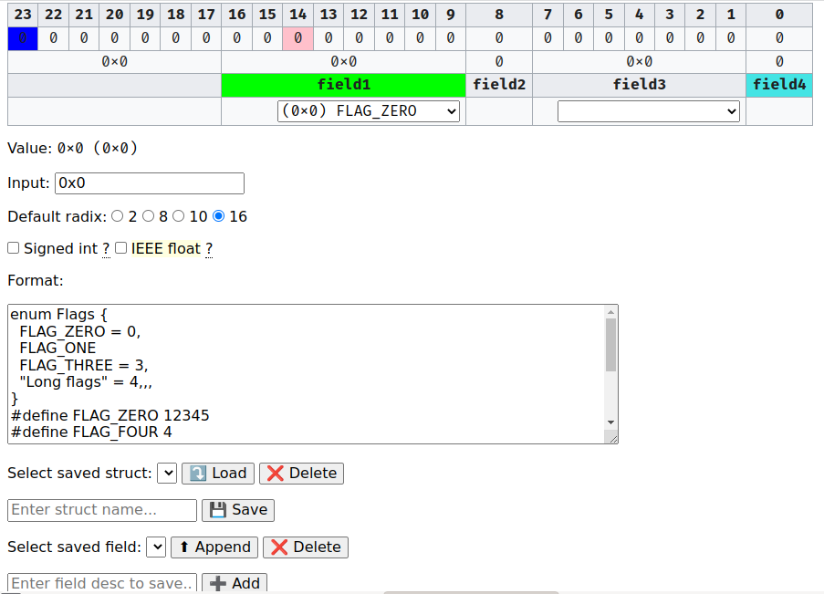

首次打开时，程序会自动展示示例寄存器定义。

界面说明：

表第一行：寄存器bit标号，从0开始，最低位为0。

表第二行：寄存器bit值，等价于`(value >> index) & 1`，单击可切换01状态。

表第三行：分字段值，以十六进制展现，单击后可修改。

表第四行：如果定义了字段对应的枚举类，则显示字段值对应的枚举名称，可从下拉菜单中选择新值。

Value：以选定的进制展示的寄存器整数值，无符号十六进制值总是在括号中显示，如果选择展示浮点数值也会在此显示。

Input：要解析的寄存器整数值，若以0b开头则解析为二进制，以0开头解析为八进制，以0x开头解析为十六进制，否则按选定的进制解析，负数解析成二补码，如果选择浮点数值则可以输入小数，解析成IEEE 754形式。

Default radix：默认进制，选择后，将在Value中以选定的进制展示寄存器整数值，同时若Input值无有效前缀时以该进制进行解析。

Signed int：选择后，Value将展示寄存器二补码整数值，即最高位为1时显示负数，否则显示无符号整数值。

IEEE float：当寄存器长度为32或64位时，选择后，Input将可以输入小数，Value将会显示寄存器中的IEEE 754浮点数值。若寄存器长度不为32或64位，选择此选项无作用。

Format：寄存器定义。见下。

Select saved struct：保存或调取预设寄存器定义，在右边下拉菜单中选择定义名，点击Load可将Format替换为已保存的寄存器定义，点击Delete可删除已保存的定义，在下面文本框中输入定义名，点击Save可将Format中的定义用此名字保存。

Select saved field：保存或调取预设字段，在右边下拉菜单中选择字段名，点击Append可向Format中追加此字段，点击Delete可删除已保存的字段，在下面文本框中输入字段定义，点击Add可保存为预设字段。

### 寄存器解码

在Input中输入寄存器整数值，上方表格将显示寄存器解码结果。

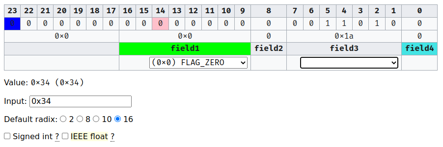

如图，field1对应16-9位，对应的值为0，对应的枚举名为FLAG_ZERO；field2只有第8位，对应值为0；field3对应7-1位，对应值为0x1a，虽然对此字段定义了枚举类，但没有枚举名对应0x1a，因此不显示。

单击表格第二行，可以切换01状态。例如，单击序号8下的0后

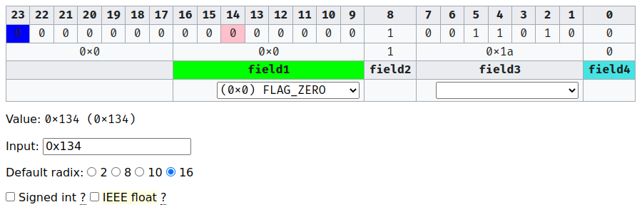

则可以将寄存器第8位翻转为1，此时将自动计算新的寄存器整数值，并在Value和Input中显示。

单击表格第三行，可以修改字段值。例如，将field3修改为0b111（即十进制7）


单击表格第四行下拉菜单，可以选择枚举名。

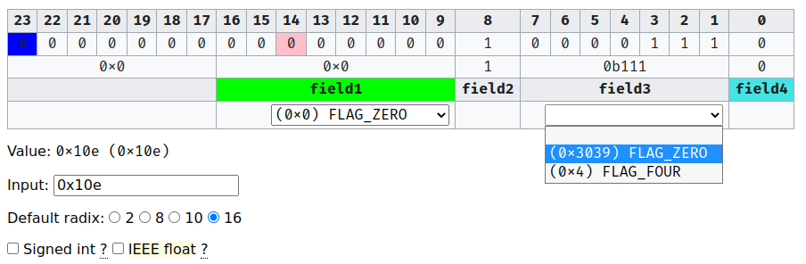

可以看到field3定义了两个枚举值，FLAG_ZERO为0x3039，FLAG_FOUR为4。选择FLAG_ZERO后

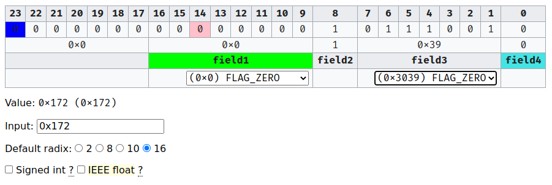

field3将设为0x3039，但field3只有7位，因此设置的是低7位，即0x39。

输入负数，将解释为二补码

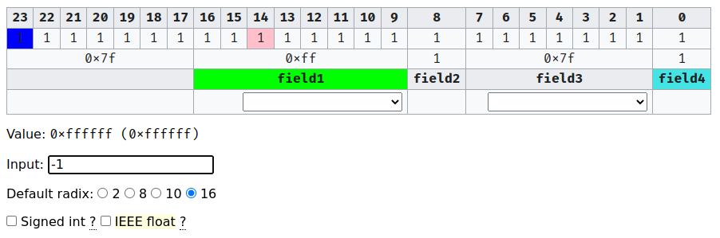

选择Default radix 10

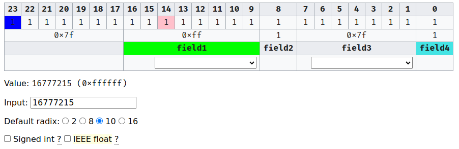

Value和Input将显示十进制数，但无符号十六进制数仍将在Value中的括号中展示。

选择了Default radix之后，仍然可以在Input中通过前缀指定进制。

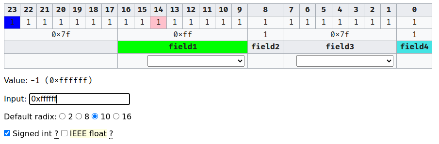

若不输入前缀，则会以Default radix解析。解析错误时会以红色显示。

f是有效的十进制数字，不输入前缀的情况下必须选择Default radix 16


选择Signed int

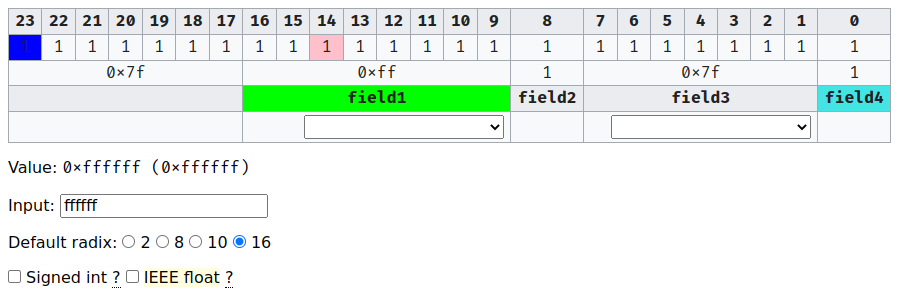

则Value将显示有符号十进制数，Input将显示无符号十进制数。

当寄存器长度为32或64位时，可以选择IEEE float开启浮点数支持。

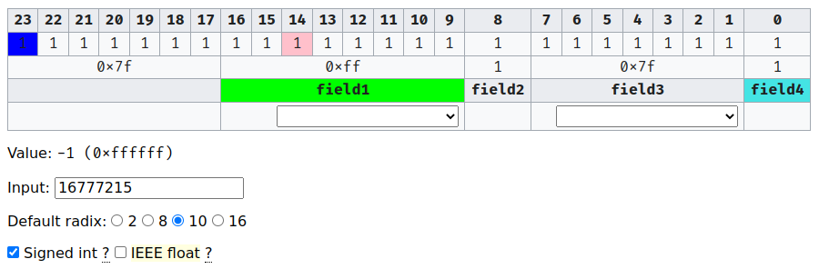

此时Input可以输入浮点数，Value将显示浮点数。但需要注意，使用科学计数法时，e也是有效的十六进制数字，若不加小数点则可能会解析成整数。

关闭浏览器再打开，系统将自动恢复上次的寄存器格式和数值。

### 寄存器格式

在Format中可以编辑寄存器格式。一行列出一个字段定义。

字段定义为：

`name[:length[:color[:enumclass]]]`

其中：

name为字段名称，不能包含:字符，不能以#，enum或typedef开头。

length为十进制表示的字段长度，若第一个字符不是数字，则该行定义定义了一个flag bit，位置从第二个字符开始规定。flag bit不增加寄存器长度。

color为表格第三行中字段的背景颜色，若为flag bit则为第二行背景颜色，可以使用HTML颜色名或CSS颜色定义。

enumclass为要使用的枚举类名称。

当属性不需要使用时，可以不写，如

`field3:7::FLAG`

定义了长度为7的字段field3，不设置背景颜色，枚举名为FLAG

`field2`

定义了长度为1的字段field2

`bit1:#14`或`bit1:'14`

定义了位于14位的flag bit1

枚举定义为类C语法，有匿名类定义和指名类定义。

```C
#define 枚举名 枚举值
```

可以定义一个属于匿名类的枚举名。

```C
enum [枚举类] {
  枚举名1 = 枚举值1,
  枚举名2
  枚举名3 = 枚举值3,
};
```

填写类名可以定义枚举类，不写类名则会将枚举名归于匿名类下。其中逗号和分号均可以重复或省略。若省略一个枚举值，则会定义为上一个值加1，默认从0开始。

```C
typedef enum [枚举类1] {...} 枚举类2
```

可以定义枚举类。


当为字段查找枚举类时，首先查看是否有对应类名的枚举类，若有则使用该类，否则将会从匿名类中选择所有以该名字作为前缀的枚举定义使用。因此，

```C
enum Flag { FLAG_ZERO }
#define FLAG_ZERO 12345
```

若字段使用 Flag枚举类，则字段将会展示`FLAG_ZERO = 0`。而若字段使用 FLAG 枚举类，则字段将会展示 `FLAG_ZERO = 12345`。

### 常用定义保存

页面底部可以管理常用字段和寄存器定义。


在文本框输入字段定义，点击Save，下次就能在下拉菜单中选择已保存的寄存器定义。点击Load，将会把Format替换为已保存的定义。

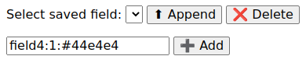

在文本框输入字段定义，点击Save，下次就能在下拉菜单中选择已保存的字段定义。点击Load，将会在Format最后一行加上此字段。
